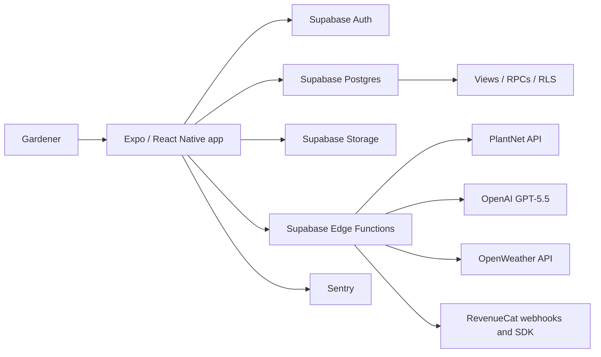
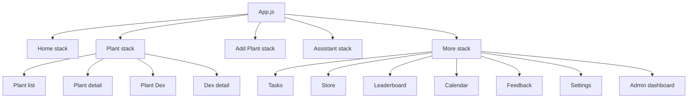
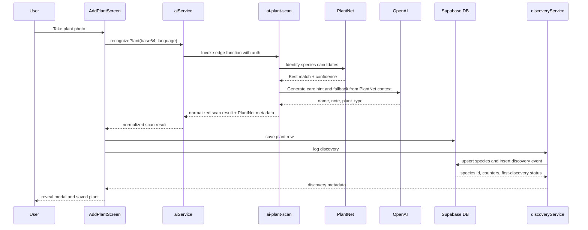
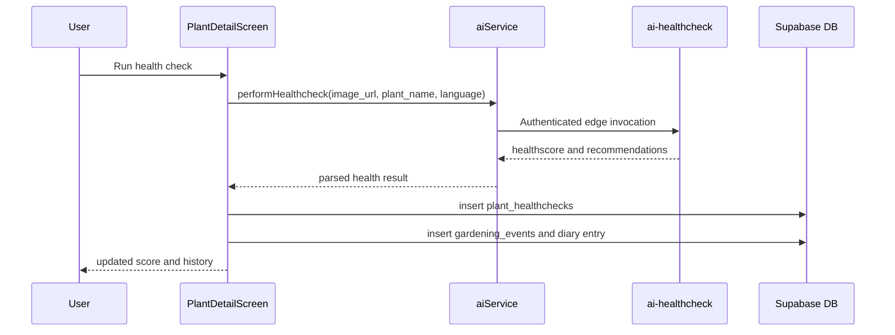
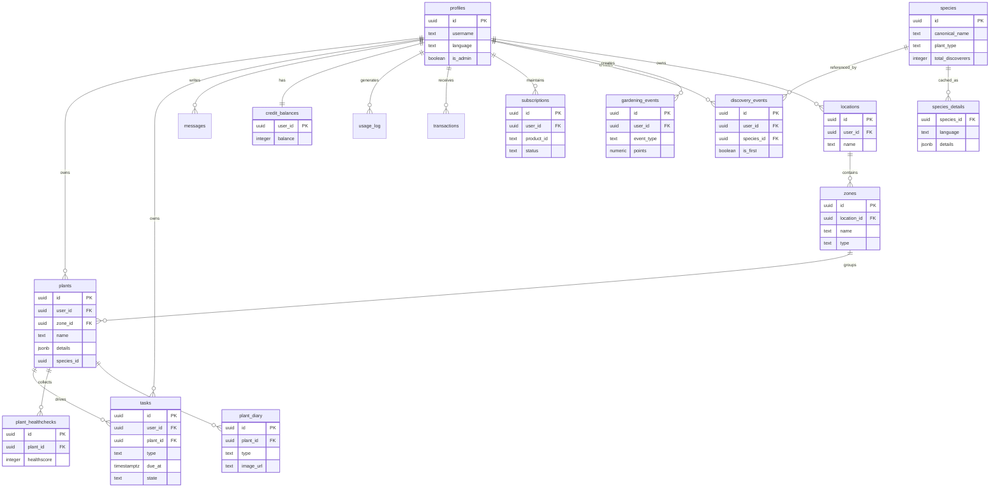
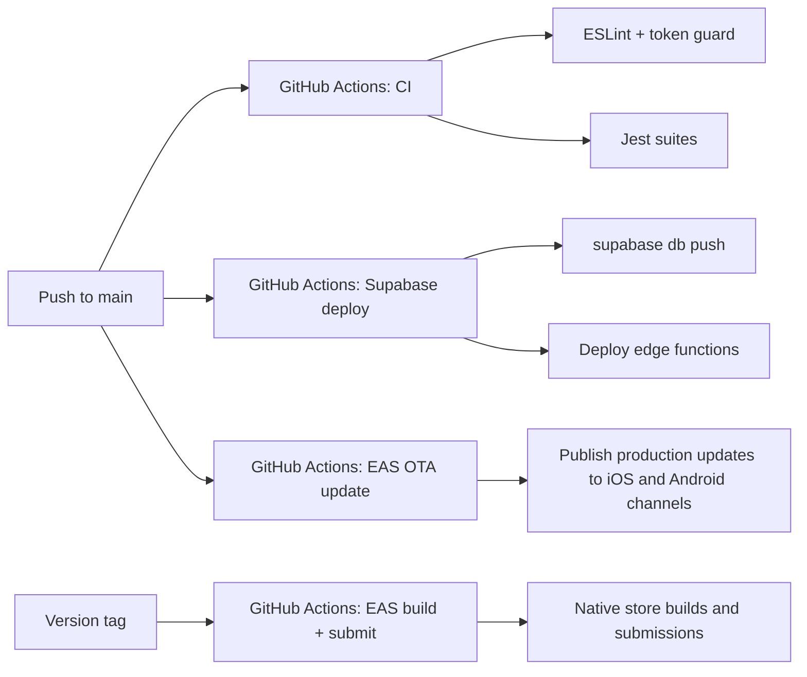

# Architecture

## Overview

FloraScout is a mobile-first gardening system built around an Expo React Native client, a Supabase backend, and a server-side AI layer implemented as Supabase Edge Functions.

Species recognition is intentionally hybrid: PlantNet provides the first-pass plant identification, while OpenAI GPT-5.5 adds care context, structured outputs, and fallback behavior when PlantNet is weak or unavailable.

The architecture optimizes for four things:

- `fast iteration` through OTA-capable JavaScript changes
- `server-side control` over AI, credits, and external APIs
- `clear domain ownership` between client services, database tables, and edge functions
- `real-world resilience` for auth, image handling, retries, and partial failures

## System Context

## Architectural Shape

### Client

- React Native `0.81` with Expo SDK `54`
- JavaScript application code
- `contexts/` for session and app-wide state
- `screens/` for route-level views
- `components/` for reusable UI pieces
- `services/` as the main business-logic seam
- `theme/` as the design-system source of truth

### Server

- Supabase Postgres as system of record
- Supabase Auth for identity
- Supabase Storage for plant images and media
- Edge Functions in TypeScript for AI, weather proxying, legal endpoints, and webhook handling

### External integrations

- PlantNet for primary species recognition from scan images
- OpenAI GPT-5.5 for care-context enrichment, plant details, health check, assistant chat, and scan fallback handling
- OpenAI GPT-4o Vision + DALL-E 3 for personalized and generic gardener avatar generation
- RevenueCat for subscriptions and one-time credit packs
- OpenWeather for weather-derived care context
- Sentry for crash and error monitoring

## Repository Map

| Area                   | Responsibility                                                |
| ---------------------- | ------------------------------------------------------------- |
| `App.js`               | Top-level navigation, tab structure, bootstrapping            |
| `contexts/`            | Auth lifecycle, profile hydration, purchase identity wiring   |
| `screens/`             | User-facing route surfaces                                    |
| `components/`          | Shared UI building blocks and state widgets                   |
| `services/`            | Client-side business logic and backend orchestration          |
| `theme/`               | Design tokens and design-system primitives                    |
| `i18n/`                | Locale dictionaries and translation runtime                   |
| `supabase/functions/`  | Edge Functions and shared server helpers                      |
| `supabase/migrations/` | Database schema, policies, views, triggers, and RPC evolution |
| `.github/workflows/`   | CI, Supabase deploys, and EAS OTA/build automation            |

## Runtime Layers

### 1. Presentation layer

The presentation layer lives in `screens/` and `components/`.

Responsibilities:

- render data and interaction states
- route users across the core loops
- delegate side effects to services
- stay visually consistent through the design system

### 2. Application-service layer

The service layer in `services/` is the main client-side orchestration boundary.

Examples:

- `aiService.js` invokes Edge Functions with auth and error normalization
- `plantService.js`, `diaryService.js`, and `taskService.js` map app actions to database writes
- `dexService.js` and `discoveryService.js` shape collection mechanics
- `creditService.js`, `purchaseService.js`, and `pricingConfig.js` define the monetization flow
- `notificationService.js` and `weatherService.js` bridge native/platform APIs and server data

### 3. Platform and infrastructure layer

This layer includes:

- Supabase client setup in `supabase.js`
- Auth session persistence with AsyncStorage
- push notifications
- maps
- image upload and signed URL resolution
- EAS update and store build workflows

## Navigation Topology

The app is organized around a small number of tab-level entry points with nested stacks.

## Primary Runtime Flows

### Scan, identify, save, discover

PlantNet is the default recognizer in this flow. OpenAI sits behind it to turn the match into user-facing care guidance and to provide a fallback path when PlantNet confidence is insufficient.

### Health check and diary loop

### Assistant loop

The assistant is intentionally not a free-form black box.

- the client sends text and optional image context
- chat history is loaded server-side
- the edge layer can decide on function calls and structured actions
- usage is credit-metered and logged

## Data Model

The schema has grown from a simple plant/task core into a multi-loop domain model.

## Key Backend Building Blocks

### Core tables

- `profiles`
- `plants`
- `tasks`
- `messages`
- `plant_healthchecks`
- `plant_diary`
- `locations`
- `zones`

### Progress and collection tables

- `species`
- `species_details`
- `discovery_events`
- `gardening_events`

### Monetization and usage tables

- `credit_balances`
- `usage_log`
- `transactions`
- `subscriptions`

### Views and RPCs

- `leaderboard_public`
- `daily_stats`
- `user_economics`
- `heatmap_grid`
- `heatmap_species_grid`
- rank- and neighbor-related RPCs for leaderboard slices

## Edge Function Topology

| Function             | Purpose                                                            |
| -------------------- | ------------------------------------------------------------------ |
| `ai-plant-scan`      | PlantNet-based species recognition plus GPT care hint and fallback |
| `ai-plant-details`   | structured species detail generation with cache                    |
| `ai-healthcheck`     | plant health scoring and recommendation generation                 |
| `ai-chat`            | assistant chat and structured tool behavior                        |
| `ai-gardener-avatar` | personalized or generic avatar generation                          |
| `weather-proxy`      | weather access without exposing raw client secrets                 |
| `revenucat-webhook`  | credit and subscription synchronization                            |
| `delete-account`     | GDPR-style account deletion flow                                   |
| `privacy-policy`     | legal endpoint                                                     |
| `terms`              | legal endpoint                                                     |
| `send-email`         | transactional outbound email support                               |

Shared server-side concerns live in `supabase/functions/_shared/`:

- auth resolution
- credits and refunds
- PlantNet invocation and response normalization
- OpenAI invocation
- language helpers
- validation
- rate limiting
- CORS handling

## Cross-Cutting Concerns

### Auth and identity

- Supabase Auth is the identity source
- sessions persist through AsyncStorage
- `AuthContext` hydrates user and profile, sets locale, and initializes RevenueCat identity
- Sentry user context is bound to the authenticated user id

### Credits and payments

- AI features are metered by `services/pricingConfig.js`
- client calls route through `aiService.js`
- server-side edge functions enforce charging, refunds, and usage logging
- RevenueCat webhooks synchronize entitlement-driven balances and subscription state

### Caching and media

- image references are stored as storage paths where possible
- signed URLs are resolved on demand in read flows
- `expo-image` is the default rendering path for modern image-heavy surfaces
- species details are cached centrally in `species_details`

### Internationalization

- locale dictionaries live in `i18n/locales/`
- profile language is applied during auth/profile hydration
- AI and structured details are generated language-aware

### Reliability and observability

- client network calls use policy wrappers for timeout and retry behavior
- AI invocation code normalizes auth, rate-limit, and insufficient-credit errors
- Sentry captures client-side runtime failures
- CI enforces zero ESLint warnings and full Jest execution on `main` and PRs

### Security model

- Postgres tables are protected through RLS
- edge functions use explicit auth handling or custom headers depending on endpoint purpose
- sensitive AI and billing logic stays server-side
- webhook and legal flows are separated from the mobile client runtime

## Delivery Pipeline

## Design Decisions

### Why a service-heavy client?

Because most product iteration happens in JavaScript, the client is intentionally organized around service modules rather than a heavier state-management framework. This keeps features shippable through OTA while still preserving seams for testing and error handling.

### Why AI behind Edge Functions?

It centralizes:

- billing
- retries
- prompt evolution
- provider credentials
- legal and abuse boundaries

This is materially safer than calling model providers directly from the client.

### Why Supabase as the main backend?

Supabase gives the project a pragmatic full-stack spine:

- auth
- relational storage
- file storage
- RLS
- edge compute
- SQL-native migrations and views

That is a strong fit for a small product team shipping quickly.

## Tradeoffs and Current Constraints

- the client codebase is mostly JavaScript, not end-to-end TypeScript
- some repository documents are historical and may describe older counts or prices
- OTA speed is a strength, but native dependency changes still require full EAS builds
- the domain model has grown organically, so service boundaries are strong but not fully formalized as separate packages

## Safe Extension Points

When adding new features, prefer extending the system in these seams:

1. add new UI surfaces in `screens/` and `components/`
2. centralize client orchestration in `services/`
3. put metered or secret-bearing logic into Edge Functions
4. evolve the schema through new migrations only
5. wire release behavior through existing GitHub Actions instead of ad hoc deploy steps

## Canonical Reading Order

For a new engineer, the fastest accurate orientation path is:

1. `README.md`
2. `VISION.md`
3. `ARCHITECTURE.md`
4. `App.js`
5. `contexts/AuthContext.js`
6. `services/`
7. `supabase/functions/`
8. `supabase/migrations/`
