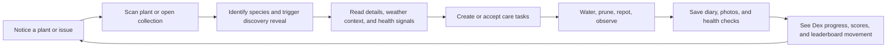

# Vision

## North Star

FloraScout turns everyday gardening into a compounding loop of noticing, understanding, and caring for living things.

It should feel like the product version of a great field notebook:

- fast enough for a phone in one hand and a watering can in the other
- smart enough to translate uncertainty into action
- rewarding enough that progress feels visible and worth returning to

## Product Thesis

Most hobby gardeners do not fail because they do not care. They fail because the moment of need is messy:

- they do not know what plant they are looking at
- they are unsure what to do next
- they forget recurring care at the wrong moment
- they cannot see whether they are getting better over time

FloraScout solves this by combining three systems into one coherent product:

1. `Recognition`  
   The app identifies plants, surfaces species context, and gives each discovery emotional weight.
2. `Care orchestration`  
   The app turns plant knowledge, weather, and user input into concrete next actions.
3. `Progress loops`  
   The app makes growth visible through the Plant Dex, diary, health checks, and leaderboard mechanics.

## Who The Product Is For

### Primary audience

- hobby gardeners with a small to medium personal plant collection
- plant-curious people who enjoy learning by doing
- users who respond well to collection, streak, and progress systems

### Secondary audience

- balcony and small-space growers
- users who treat gardening as a calming routine
- people who want a practical AI assistant, not a generic chatbot

### Explicit non-audience

- professional agriculture operations
- scientific taxonomic workflows
- marketplace-first users who primarily want to buy and sell plants
- users who want an unbounded general-purpose assistant

## Product Promise

FloraScout should answer five user questions extremely well:

1. `What is this plant?`
2. `What should I do next?`
3. `What changed since last time?`
4. `How healthy is this plant right now?`
5. `Am I becoming a better gardener?`

If the product is excellent, users feel more capable after each interaction, not merely more informed.

## Experience Pillars

### 1. Discovery must feel rewarding

Scanning a plant is not just data entry. It is the front door into the product. The reveal moment, collection progress, rarity cues, and first-discovery status are not decoration; they are retention mechanics.

### 2. Care must collapse ambiguity into action

Advice is only useful if it becomes a task, a decision, or a next step. FloraScout should prefer practical guidance over encyclopedic sprawl.

### 3. Progress must be visible

Collections, diary entries, health scores, galleries, and leaderboards all serve the same purpose: showing that the user is building competence over time.

### 4. Intelligence must earn trust

AI should accelerate the user, not bluff them. The product should be transparent about uncertainty, resilient to transient failures, and conservative with destructive or high-confidence claims.

### 5. The system should invite return visits

The product is strongest when it becomes part of a weekly rhythm:
scan, review, care, log, improve.

## Core Product Loop

## Strategic Product Bets

### The Plant Dex is the emotional center

The Dex is more than a list. It is the memory structure of the app. It turns every scan into a collectible, every plant into a species entry, and every return visit into measurable progress.

### AI is product infrastructure, not the product itself

The scanner, health check, species details, avatar generation, and assistant are all important, but they only matter insofar as they make the gardening workflow better. The product should never collapse into "ask AI anything."

### Care orchestration beats passive content

Static plant information is commoditized. The durable value sits in timing, prioritization, and adapting advice to the user's context.

### Lightweight game systems increase adherence

Discovery status, first-finder moments, badges, credits, and leaderboards are not gimmicks when they reinforce care behavior. They should remain supportive, not manipulative.

## Business Intent

FloraScout monetizes through credits and subscriptions, but monetization must stay subordinate to trust.

That means:

- paid features should feel like acceleration, not ransom
- free moments must still deliver delight and competence
- credit costs should remain legible and predictable
- monetization should reinforce repeat value, not interrupt it

## Success Criteria

### User value signals

- a first-time user identifies a plant and understands the next step within minutes
- returning users complete tasks because the app reduces planning friction
- the collection view becomes a destination, not a dead archive

### Product health signals

- repeat scan behavior
- recurring task completion
- health check reuse
- diary/gallery accumulation
- Plant Dex progression over time

### Business signals

- healthy conversion from free use to credits or subscription
- high retention among users who complete the discovery-to-care loop
- low support burden caused by confusing AI or pricing behavior

## Product Boundaries

FloraScout should avoid becoming:

- a generic plant content encyclopedia
- a noisy social feed
- a hyper-complex project management tool
- a brittle "AI magic" experience with no fallbacks

Simplicity is part of the product strategy.

## Decision Filter

When evaluating roadmap ideas, prefer work that improves at least one of these:

1. `Time to first useful outcome`
2. `Clarity of the next care action`
3. `Emotional reward of discovery and progress`
4. `Retention through recurring plant routines`
5. `Trustworthiness of the system under real-world constraints`

If an idea does not improve one of those, it is probably not core.

## Horizon

### Now

- make scanning, discovery, and care loops feel polished and dependable
- strengthen the Dex as the main retention surface
- keep OTA-deliverable improvements flowing quickly

### Next

- deeper personalized care planning
- better species-level insight and smarter reminders
- more useful admin and operational tooling around AI and content quality

### Later

- richer home and zone intelligence
- longitudinal plant outcome analysis
- stronger social proof without sacrificing calmness or utility

## In One Sentence

FloraScout exists to make plant care feel less uncertain, more actionable, and visibly rewarding over time.
