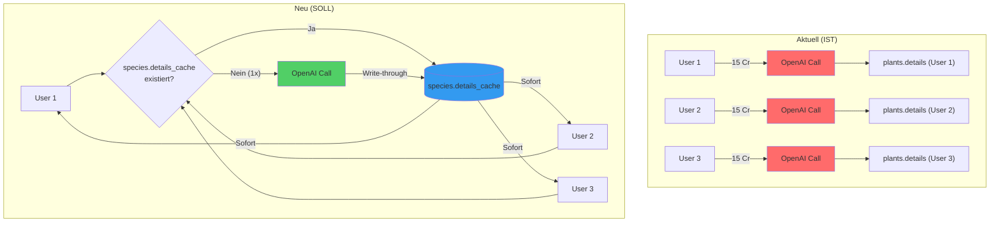
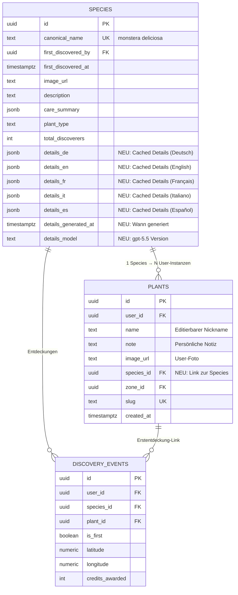
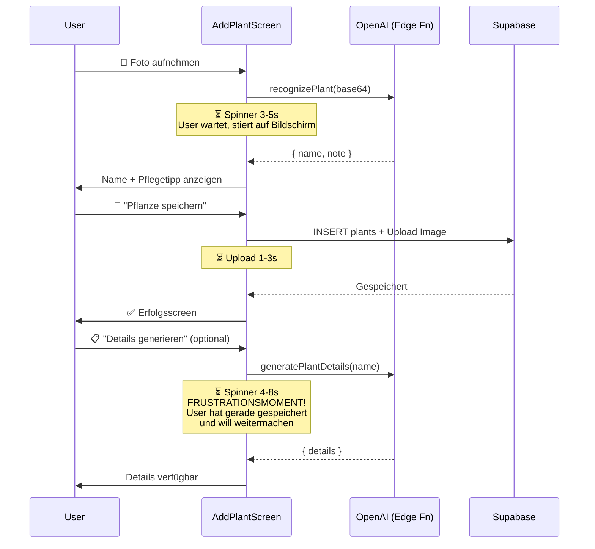
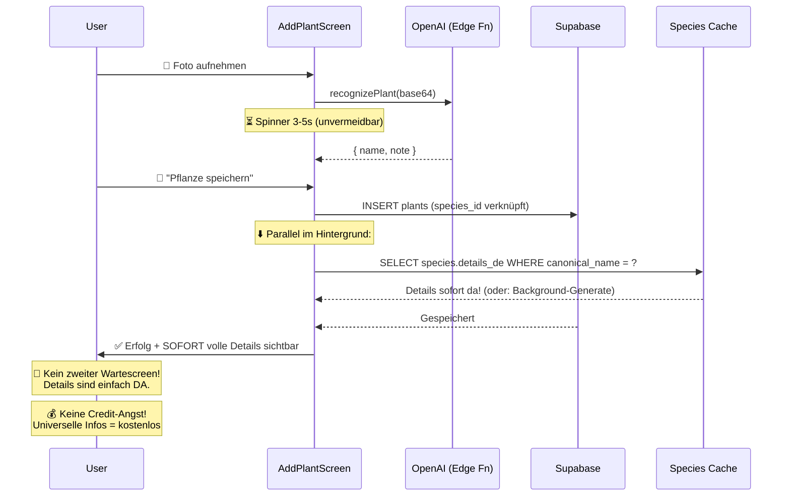

# Architektur-Analyse: Zentraler Pflanzen-Dex vs. On-Demand LLM-Generierung

**Datum:** 2026-03-08
**Scope:** Mein Gärtner App – Plant Details, Dex, Discovery System
**Autor:** Architektur-Review (Claude)

---

## 1. Ist-Zustand: LLM-Call-Landkarte

### 1.1 Alle LLM-Call-Stellen im Code

Die App macht an **4 Stellen** LLM-Calls über Supabase Edge Functions:

| #   | Edge Function      | Trigger (UI)                                                                        | Service-Methode                    | Kosten     | Modell             |
| --- | ------------------ | ----------------------------------------------------------------------------------- | ---------------------------------- | ---------- | ------------------ |
| 1   | `ai-plant-scan`    | AddPlantScreen → Kamera                                                             | `aiService.recognizePlant()`       | 12 Credits | PlantNet + gpt-5.5 |
| 2   | `ai-plant-details` | AddPlantScreen → "Details generieren" ODER PlantDetailScreen → "Details generieren" | `aiService.generatePlantDetails()` | 15 Credits | gpt-5.5            |
| 3   | `ai-healthcheck`   | AddPlantScreen / PlantDetailScreen → "Healthcheck"                                  | `aiService.performHealthcheck()`   | 8 Credits  | gpt-5.5 (Vision)   |
| 4   | `ai-chat`          | AssistantScreen → Chat mit "Ben"                                                    | `aiService.chatWithBen()`          | 3 Credits  | gpt-5.5            |

### 1.2 Der kritische Pfad: `ai-plant-details`

**Dieser Call ist der Hauptkandidat für Deduplizierung.** Der Flow:

```
User scannt Pflanze → speichert → klickt "Details generieren"
    ↓
aiService.generatePlantDetails(name, note, language)
    ↓
Edge Function: ai-plant-details/index.ts
    ↓
15 Credits abgezogen (atomar, Zeile 242)
    ↓
OpenAI gpt-5.5 Call mit Prompt + Schema (Zeile 276-279)
    ↓
JSON zurück: { overview, care, extras }
    ↓
Gespeichert in: plants.details (JSONB, user-spezifisch!)
```

**Dateien im Detail:**

- **`services/aiService.js` (Zeile 209-211):** `generatePlantDetails()` ruft `callEdgeFunction('ai-plant-details', ...)` auf
- **`supabase/functions/ai-plant-details/index.ts` (Zeile 264-279):** OpenAI-Prompt mit sprachabhängigem Schema
- **`screens/PlantDetailScreen.js` (Zeile 172-186):** Speichert Ergebnis in `plants.details` via `supabase.from('plants').update({ details })`
- **`screens/AddPlantScreen.js` (Zeile 300-322):** Gleiches nach dem initialen Speichern

### 1.3 Redundanz-Analyse

**Kernproblem:** Die Details werden pro User-Plant-Instanz gespeichert (`plants.details`), nicht pro Species.

```
Szenario: 100 User haben "Monstera Deliciosa"

IST-Zustand:
├── User 1: Scan (12 Cr) → Details (15 Cr) → plants.details = {overview, care, extras}
├── User 2: Scan (12 Cr) → Details (15 Cr) → plants.details = {overview, care, extras}  ← IDENTISCH
├── User 3: Scan (12 Cr) → Details (15 Cr) → plants.details = {overview, care, extras}  ← IDENTISCH
└── ...User 100: 15 Credits für identische Informationen

Kosten: 100 × 15 Credits = 1.500 Credits für DIESELBE PFLANZE
OpenAI: 100 × ~500-600 Tokens Output = ~50.000-60.000 Tokens
```

**Wichtig:** Es existiert BEREITS eine `species`-Tabelle mit `description` und `care_summary` Feldern – diese werden aber **nicht** mit den generierten Details befüllt. Die species-Tabelle hat nur:

- `canonical_name` (beim Erstentdecken gesetzt)
- `description` → leer / manuell
- `care_summary` → leer JSONB `{}`

### 1.4 Datenklassifikation: Universell vs. User-spezifisch

| Datenfeld                           | Scope                          | Aktueller Speicherort      | Sollte sein             |
| ----------------------------------- | ------------------------------ | -------------------------- | ----------------------- |
| Botanischer Name, Familie, Herkunft | **Universell** (Species-Level) | `plants.details.overview`  | `species.details_cache` |
| Lebensform, Größe, Blütezeit        | **Universell**                 | `plants.details.overview`  | `species.details_cache` |
| Licht, Temperatur, Gießen, Düngen   | **Universell**                 | `plants.details.care`      | `species.details_cache` |
| Giftigkeit, Vermehrung, Schädlinge  | **Universell**                 | `plants.details.extras`    | `species.details_cache` |
| Fun Fact / Kultur                   | **Universell**                 | `plants.details.extras`    | `species.details_cache` |
| Pflanzen-Foto                       | **User-spezifisch**            | `plants.image_url`         | bleibt                  |
| Standort / Zone                     | **User-spezifisch**            | `plants.zone_id`           | bleibt                  |
| Nickname / Benutzername             | **User-spezifisch**            | `plants.name` (editierbar) | bleibt                  |
| Persönliche Notiz                   | **User-spezifisch**            | `plants.note`              | bleibt                  |
| Healthcheck-Ergebnisse              | **User-spezifisch**            | `plant_healthchecks`       | bleibt                  |
| Tagebuch-Einträge                   | **User-spezifisch**            | `plant_diary`              | bleibt                  |

**Erkenntnis:** ~95% der `plants.details` JSON-Felder sind universell und identisch für jede Monstera, unabhängig vom User.

---

## 2. Zentraler Pflanzen-Dex – Architekturvorschlag

### 2.1 Architektur-Diagramm



### 2.2 Erweitertes Datenbank-Schema



### 2.3 Schema-Migration (SQL)

```sql
-- ═══════════════════════════════════════════════════════════════
-- Migration: Zentraler Pflanzen-Dex Cache
-- ═══════════════════════════════════════════════════════════════

-- 1. Neue Spalten für gecachte Details pro Sprache
ALTER TABLE public.species
  ADD COLUMN IF NOT EXISTS details_de JSONB,
  ADD COLUMN IF NOT EXISTS details_en JSONB,
  ADD COLUMN IF NOT EXISTS details_fr JSONB,
  ADD COLUMN IF NOT EXISTS details_it JSONB,
  ADD COLUMN IF NOT EXISTS details_es JSONB,
  ADD COLUMN IF NOT EXISTS details_generated_at TIMESTAMPTZ,
  ADD COLUMN IF NOT EXISTS details_model TEXT;

-- 2. Species-Referenz in plants-Tabelle
ALTER TABLE public.plants
  ADD COLUMN IF NOT EXISTS species_id UUID REFERENCES public.species(id);

-- 3. Index für schnelle Lookups
CREATE INDEX IF NOT EXISTS idx_species_details_de
  ON public.species(id) WHERE details_de IS NOT NULL;
CREATE INDEX IF NOT EXISTS idx_plants_species_id
  ON public.plants(species_id);

-- 4. Backfill: Bestehende plants mit species verknüpfen
UPDATE public.plants p
SET species_id = s.id
FROM public.species s
WHERE LOWER(TRIM(p.name)) = s.canonical_name
  AND p.species_id IS NULL;
```

### 2.4 Trennung: Was gehört wohin?

```
┌─────────────────────────────────────────────────────┐
│  SPECIES (Zentraler Dex)                            │
│  = Wissen über die Art                              │
│                                                     │
│  ✅ Botanischer Name, Familie, Herkunft             │
│  ✅ Pflegehinweise (Licht, Wasser, Temperatur)      │
│  ✅ Giftigkeit, Vermehrung, Schädlinge              │
│  ✅ Fun Facts                                       │
│  ✅ Referenz-Bild (Community-Best oder KI-generiert) │
│  ✅ Discovery-Statistiken                           │
│  ✅ Heatmap-Daten                                   │
└─────────────────────────────────────────────────────┘

┌─────────────────────────────────────────────────────┐
│  PLANTS (User-Instanz)                              │
│  = Meine konkrete Pflanze                           │
│                                                     │
│  ✅ Mein Foto                                       │
│  ✅ Mein Nickname ("Herbert die Monstera")           │
│  ✅ Meine Notiz ("Flohmarkt-Fund, Mai 2025")        │
│  ✅ Mein Standort / Zone                            │
│  ✅ Meine Healthchecks (individueller Zustand)       │
│  ✅ Mein Tagebuch                                   │
│  ✅ Meine Aufgaben (gießen, düngen)                 │
│  🔗 species_id → Link zum zentralen Wissen         │
└─────────────────────────────────────────────────────┘
```

---

## 3. Kosten-Nutzen-Analyse

### 3.1 Credit-Einsparungen

**Annahmen (konservativ):**

- 500 aktive User
- Durchschnittlich 4 Pflanzen pro User = 2.000 Plant-Instanzen
- 300 unique Species im Dex
- 80% der User generieren Details für ihre Pflanzen
- Durchschnittlich 6,7 User pro Species (2.000 / 300)

| Metrik                           | IST (On-Demand)                 | SOLL (Zentraler Dex)         | Einsparung                |
| -------------------------------- | ------------------------------- | ---------------------------- | ------------------------- |
| Detail-Generierungen             | 1.600 Calls (80% von 2.000)     | 300 Calls (1x pro Species)   | **1.300 Calls (−81%)**    |
| Credit-Verbrauch                 | 1.600 × 15 = **24.000 Credits** | 300 × 15 = **4.500 Credits** | **19.500 Credits (−81%)** |
| OpenAI-Tokens (Output)           | ~960.000 Tokens                 | ~180.000 Tokens              | **780.000 Tokens**        |
| OpenAI-Kosten (Output @ $10/1M)  | ~$9,60                          | ~$1,80                       | **$7,80 (−81%)**          |
| OpenAI-Kosten (Input @ $2.50/1M) | ~$2,00                          | ~$0,38                       | **$1,62**                 |

**Bei Wachstum auf 5.000 User:**

- IST: 16.000 × 15 = **240.000 Credits**, ~$96 OpenAI-Kosten
- SOLL: 500 × 15 = **7.500 Credits**, ~$3 OpenAI-Kosten (Species-Katalog wächst langsam)
- **Einsparung: 97% der LLM-Kosten für Plant Details**

### 3.2 Latenz-Verbesserung

| Aktion                                    | IST (Latenz)              | SOLL (Latenz)               | Verbesserung                |
| ----------------------------------------- | ------------------------- | --------------------------- | --------------------------- |
| Pflanze scannen                           | ~3-5s (LLM Vision)        | ~3-5s (LLM Vision)          | Keine Änderung              |
| Details anzeigen (erstmals)               | ~4-8s (LLM-Call + Parse)  | ~50-100ms (DB-Read)         | **40-160x schneller**       |
| Details anzeigen (Species bereits im Dex) | ~4-8s (erneuter LLM-Call) | **Sofort** (0ms, cached)    | **∞ schneller**             |
| PlantDexScreen laden                      | ~200ms (nur DB)           | ~200ms (mit Details!)       | Details jetzt inkl.         |
| DexDetailScreen                           | ~100ms (species nur)      | ~100ms (mit vollen Details) | Mehr Content, gleiche Speed |

### 3.3 Nicht-monetäre Vorteile

- **Konsistenz:** Alle User sehen dieselben Pflegehinweise für Monstera (keine LLM-Halluzinations-Abweichungen)
- **Offline-Ready:** Gecachte Details können lokal vorgehalten werden (AsyncStorage)
- **Qualitätskontrolle:** Zentrale Details können manuell geprüft/korrigiert werden
- **SEO-Potenzial:** Dex-Seiten mit stabilen Inhalten für Web-Version nutzbar
- **Onboarding:** Neue User sehen sofort Inhalte statt leere Screens

---

## 4. UX-Analyse: "Sammeln"-Oberfläche

### 4.1 Aktuelle Wartezeiten (Psychologen-Perspektive)



**Kritische UX-Probleme:**

1. **Doppelte Wartezeit:** User wartet erst beim Scan (akzeptabel), dann nochmal bei "Details generieren" (frustrierend). Die zweite Wartezeit fühlt sich unnötig an, weil der User gerade seine Pflanze gespeichert hat und in einem "Abschluss-Modus" ist.

2. **Verlustangst bei Credits:** Der "Details generieren"-Button kostet 15 Credits. User zögern → "Brauche ich das wirklich?" → schlechte Conversion. Ein vorausgefüllter Dex nimmt diese Hürde komplett weg.

3. **Leere Pflanzenseite:** Ohne generierte Details zeigt PlantDetailScreen nur Name + Foto. Die Overview/Care/Extras-Tabs sind leer mit einem "Details generieren"-CTA. Das fühlt sich unvollständig an.

4. **Inkonsistenter Dex:** DexDetailScreen zeigt nur `species.description` und `species.care_summary` – die sind aktuell leer oder minimal. Die vollen Details existieren nur in `plants.details` bei einzelnen Usern.

### 4.2 UX-Verbesserungen durch zentralen Dex



**Konkrete UX-Gewinne:**

| Vorher                                         | Nachher                              | Psychologischer Effekt                         |
| ---------------------------------------------- | ------------------------------------ | ---------------------------------------------- |
| Leerer Pflanzensteckbrief bis User 15 Cr zahlt | Voller Steckbrief sofort nach Scan   | **Sofortige Belohnung** – Dopamin beim Sammeln |
| "Details generieren" Button als Paywall        | Details sind Teil des Dex (inklusiv) | **Kein Verlustangst-Moment**                   |
| 4-8s Wartezeit bei Details                     | 0ms – bereits im Cache               | **Flow-Zustand** bleibt erhalten               |
| Leere DexDetailScreen                          | Vollständige Artenbeschreibung       | **Sammler-Motivation** steigt                  |
| Inkonsistente Infos (LLM-Varianz)              | Einheitliche, geprüfte Infos         | **Vertrauen** in die App                       |

### 4.3 Gamification-Potenzial

Der zentrale Dex eröffnet neue Motivations-Mechaniken:

- **"Dex vervollständigen":** Progress-Bar zeigt X/Y Arten mit vollen Steckbriefen → Sammel-Trieb
- **Community-Erstentdecker-Bonus:** Wer eine neue Art zum Dex hinzufügt, bekommt Credit-Reward (existiert bereits via `award_discovery_credits`)
- **Dex-Level:** Bronze (10 Arten), Silber (50), Gold (100) → Leaderboard-Integration
- **Saisonale Challenges:** "Entdecke 5 Blühpflanzen im März" mit Dex als Tracking

---

## 5. Migrations-Plan

### Phase 1: Schema-Erweiterung (Breaking Nothing)

**Zeitaufwand:** ~2h
**Risiko:** Keins (nur neue Spalten)

```sql
-- Migration: add_species_details_cache.sql
ALTER TABLE public.species
  ADD COLUMN IF NOT EXISTS details_de JSONB,
  ADD COLUMN IF NOT EXISTS details_en JSONB,
  ADD COLUMN IF NOT EXISTS details_fr JSONB,
  ADD COLUMN IF NOT EXISTS details_it JSONB,
  ADD COLUMN IF NOT EXISTS details_es JSONB,
  ADD COLUMN IF NOT EXISTS details_generated_at TIMESTAMPTZ,
  ADD COLUMN IF NOT EXISTS details_model TEXT;

ALTER TABLE public.plants
  ADD COLUMN IF NOT EXISTS species_id UUID REFERENCES public.species(id);

-- RLS: Species-Details sind für alle lesbar
CREATE POLICY "Anyone can read species details"
  ON public.species FOR SELECT
  USING (true);
```

**Code-Änderung:** Keine. Alles ist additiv.

### Phase 2: Backfill bestehende Daten

**Zeitaufwand:** ~3h
**Risiko:** Niedrig (schreibt nur in neue Spalten)

```sql
-- 2a. Verknüpfe bestehende plants mit species
UPDATE public.plants p
SET species_id = s.id
FROM public.species s
WHERE LOWER(TRIM(p.name)) = s.canonical_name
  AND p.species_id IS NULL;

-- 2b. Migriere erste vorhandene Details in den Species-Cache
-- (Nimmt die Details des Erstentdeckers als Basis)
WITH first_details AS (
  SELECT DISTINCT ON (s.id)
    s.id AS species_id,
    p.details
  FROM public.species s
  JOIN public.discovery_events de ON de.species_id = s.id AND de.is_first = true
  JOIN public.plants p ON p.id = de.plant_id
  WHERE p.details IS NOT NULL
  ORDER BY s.id, p.created_at ASC
)
UPDATE public.species s
SET details_de = fd.details,
    details_generated_at = NOW(),
    details_model = 'gpt-5.5 (backfill from user data)'
FROM first_details fd
WHERE s.id = fd.species_id
  AND s.details_de IS NULL;
```

### Phase 3: Edge Function anpassen (Write-Through Cache)

**Zeitaufwand:** ~4h
**Risiko:** Mittel – Hauptlogik-Änderung

**Datei: `supabase/functions/ai-plant-details/index.ts`**

Änderung: Vor dem LLM-Call prüfen, ob Species-Cache existiert.

```typescript
// NEUE LOGIK (Zeile ~260, vor dem OpenAI-Call einfügen):

// 1. Species-Cache prüfen
const langCol = `details_${resolvedLanguage}` as const;
const { data: speciesRow } = await serviceClient
  .from('species')
  .select(`id, ${langCol}, details_generated_at`)
  .eq('canonical_name', name.trim().toLowerCase())
  .maybeSingle();

if (speciesRow?.[langCol]) {
  // Cache-Hit! Credits zurückerstatten, Cache liefern
  await refundCredits(serviceClient, userId, cost);
  return new Response(
    JSON.stringify({
      details: speciesRow[langCol],
      balance: newBalance + cost,  // Refund
      credits_used: 0,
      source: 'dex_cache',
    }),
    { headers: { ...corsHeaders, 'Content-Type': 'application/json' } }
  );
}

// 2. Cache-Miss → LLM-Call wie bisher
const result = await callOpenAI({ ... });

// 3. Write-Through: Ergebnis in Species-Cache schreiben
if (speciesRow?.id && details) {
  await serviceClient
    .from('species')
    .update({
      [langCol]: details,
      details_generated_at: new Date().toISOString(),
      details_model: result.model,
    })
    .eq('id', speciesRow.id);
}
```

### Phase 4: Client-Code anpassen

**Zeitaufwand:** ~4h
**Risiko:** Mittel

**4a. `services/plantService.js` – Species-ID beim Speichern setzen:**

```javascript
// In savePlant() oder wo plants eingefügt werden:
// Nach dem Scan: species_id aus logDiscovery() übernehmen
const { data: plant } = await supabase
  .from('plants')
  .insert({
    user_id: userId,
    name: plantName,
    note: plantNote,
    image_url: imageUrl,
    species_id: discovery?.speciesId, // NEU
  })
  .select()
  .single();
```

**4b. `screens/PlantDetailScreen.js` – Details aus Species laden:**

```javascript
// Aktuell (Zeile ~130): Details aus plant.details
// NEU: Fallback auf species.details_XX

const loadPlantDetails = async () => {
  // 1. Eigene Details vorhanden?
  if (plant.details) return plant.details;

  // 2. Species-Cache prüfen
  if (plant.species_id) {
    const lang = getCurrentLanguage(); // 'de', 'en', etc.
    const { data: species } = await supabase
      .from('species')
      .select(`details_${lang}`)
      .eq('id', plant.species_id)
      .single();

    if (species?.[`details_${lang}`]) {
      return species[`details_${lang}`];
    }
  }

  // 3. Kein Cache → "Details generieren" Button anzeigen
  return null;
};
```

**4c. `screens/AddPlantScreen.js` – "Details generieren" nur wenn kein Cache:**

```javascript
// Aktuell (Zeile ~544-553): Button immer sichtbar
// NEU: Ausblenden wenn Species-Cache vorhanden

const [hasCachedDetails, setHasCachedDetails] = useState(false);

// Nach dem Speichern prüfen:
useEffect(() => {
  if (discovery?.speciesId) {
    const lang = getCurrentLanguage();
    supabase
      .from('species')
      .select(`details_${lang}`)
      .eq('id', discovery.speciesId)
      .single()
      .then(({ data }) => {
        if (data?.[`details_${lang}`]) setHasCachedDetails(true);
      });
  }
}, [discovery]);

// Button nur anzeigen wenn KEIN Cache:
{
  !hasCachedDetails && <DSButton title="Details generieren" onPress={handleGenerateDetails} />;
}
```

**4d. `services/dexService.js` – Details im Dex mitladen:**

```javascript
// In fetchDex() (Zeile 19-24): Details-Spalte mit selektieren
const { data: allSpecies } = await supabase
  .from('species')
  .select(
    'id, canonical_name, first_discovered_by, first_discovered_at, ' +
      'image_url, description, care_summary, total_discoverers, plant_type, ' +
      `details_${language}` // NEU
  )
  .order('canonical_name', { ascending: true });
```

### Phase 5: Credits-Modell anpassen

**Zeitaufwand:** ~1h
**Entscheidung erforderlich:**

| Option                        | Beschreibung                                                    | Empfehlung                     |
| ----------------------------- | --------------------------------------------------------------- | ------------------------------ |
| A: Details werden kostenlos   | Universelle Infos aus dem Dex kosten nichts                     | ✅ **Empfohlen** – maximale UX |
| B: Reduzierte Kosten          | 5 Credits statt 15 (nur DB-Read)                                | Kompromiss                     |
| C: Nur Erstgenerierung kostet | Wer eine neue Art erstmals generiert, zahlt. Alle danach gratis | Fair & gamifiziert             |

**Empfehlung: Option C** – Der Erstentdecker "sponsort" den Dex-Eintrag (15 Credits), alle anderen profitieren kostenlos. Das verstärkt den Entdecker-Anreiz.

### Phase 6: Seed-Dex für Top-100-Pflanzen

**Zeitaufwand:** ~2h (einmaliger Batch-Job)

```javascript
// Script: scripts/seed-dex-details.js
const TOP_100_PLANTS = [
  'monstera deliciosa',
  'ficus lyrata',
  'sansevieria trifasciata',
  'pothos aureus',
  'calathea orbifolia',
  'philodendron hederaceum',
  // ... 94 weitere
];

for (const species of TOP_100_PLANTS) {
  for (const lang of ['de', 'en', 'fr', 'it', 'es']) {
    const details = await generatePlantDetails(species, '', lang);
    await supabase
      .from('species')
      .update({
        [`details_${lang}`]: details,
        details_generated_at: new Date().toISOString(),
        details_model: 'gpt-5.5 (seed)',
      })
      .eq('canonical_name', species);
  }
}
// Einmalkosten: 100 × 5 Sprachen × ~$0.06 = ~$30
```

---

## 6. Zusammenfassung & Empfehlung

### Prioritätsreihenfolge

| Phase                  | Aufwand | Impact               | Prio                    |
| ---------------------- | ------- | -------------------- | ----------------------- |
| 1: Schema-Erweiterung  | 2h      | Fundament            | 🔴 Sofort               |
| 2: Backfill            | 3h      | Bestandsdaten nutzen | 🔴 Sofort               |
| 3: Edge Function Cache | 4h      | Kernlogik            | 🟠 Diese Woche          |
| 4: Client-Anpassung    | 4h      | UX-Verbesserung      | 🟠 Diese Woche          |
| 5: Credit-Modell       | 1h      | Monetarisierung      | 🟡 Nach Testing         |
| 6: Seed Top-100        | 2h      | Day-1 Experience     | 🟡 Vor nächstem Release |

**Gesamtaufwand:** ~16h Entwicklung + Testing
**Erwartete Einsparung:** 81-97% der LLM-Kosten für Plant Details
**UX-Impact:** Eliminiert 4-8s Wartezeit für 80%+ der Detail-Aufrufe

### Risiken

- **LLM-Varianz:** Verschiedene Sprachen können leicht unterschiedliche Qualität haben → manuelles Review der Seed-Daten empfohlen
- **Schema-Lock:** Wenn das Detail-JSON-Schema geändert wird, müssen alle gecachten Einträge invalidiert werden → `details_model`-Feld als Versions-Marker nutzen
- **Race Condition:** Zwei User generieren gleichzeitig Details für eine neue Art → Erster schreibt, Zweiter bekommt Refund (Edge Function Logik aus Phase 3 handhabt das)

---

_Dieses Dokument dient als Entscheidungsgrundlage. Alle Code-Beispiele sind als Konzeptvorschläge zu verstehen und müssen vor der Implementierung gegen die aktuelle Codebasis getestet werden._

---

## 7. Codex-Review (gegen aktuelle Codebasis validiert)

### 7.1 Bewertung: Ist die Änderung sinnvoll?

**Ja, klar sinnvoll.**

Der Kernansatz (universelle Art-Informationen zentral cachen statt pro User-Pflanze neu zu generieren) passt sehr gut zur bestehenden Architektur und löst ein echtes Kosten-/UX-Problem.

### 7.2 Was am aktuellen Entwurf bereits stark ist

- Richtige Problemidentifikation: `plants.details` dupliziert universelle Inhalte.
- Gute Produktperspektive: weniger Wartezeit, weniger Friktion durch Credits, konsistentere Inhalte.
- Richtige Stoßrichtung: Cache auf Species-Level mit Write-Through bei Cache-Miss.

### 7.3 Kritische Korrekturen vor Umsetzung (Must-Fix)

1. **Sprache/Schema ist unvollständig:**
   Das vorgeschlagene Spaltenmodell `details_de/en/fr/it/es` ignoriert, dass die App bereits **`ru`** unterstützt. Jede neue Sprache würde Schema-Migrationen erzwingen.

2. **Backfill über `plants.name = species.canonical_name` ist fachlich unsicher:**
   `plants.name` ist editierbarer Nutzername/Nickname. Zuverlässiger ist Backfill über vorhandene `discovery_events.plant_id -> species_id`.

3. **`species_id` kann im aktuellen Save-Flow nicht direkt beim Insert gesetzt werden:**
   In `AddPlantScreen` wird `plant` zuerst gespeichert und `logDiscovery(...)` erst danach aufgerufen. `species_id` muss daher initial `NULL` sein und danach per Update gesetzt werden (oder Flow wird umgebaut).

4. **Credit-Flow im Entwurf ist suboptimal:**
   Erst abbuchen und dann Cache prüfen erzeugt unnötige Refunds. Besser: **erst Cache-Lookup, dann Abbuchung nur bei Miss**.

5. **Race-Condition bei gleichzeitigem Miss bleibt real:**
   Ohne Locking können 2 Nutzer dieselbe Art/Sprache parallel generieren. Dafür braucht es mindestens Double-Check + Refund, idealerweise DB-Lock/Claim.

6. **Index-Vorschlag `idx_species_details_de ON species(id) WHERE details_de IS NOT NULL` ist praktisch wirkungslos:**
   `id` ist bereits PK-indexiert. Der vorgeschlagene partielle Index bringt keinen spürbaren Mehrwert.

7. **RLS-Policy-Duplikat:**
   Eine öffentliche Select-Policy auf `species` existiert bereits (`Anyone can read species`).

---

## 8. Verbesserte Zielarchitektur (empfohlen)

### 8.1 Datenmodell: eigene Tabelle statt Sprachspalten

Statt `details_de`, `details_en`, ...:

```sql
CREATE TABLE IF NOT EXISTS public.species_details (
  species_id UUID NOT NULL REFERENCES public.species(id) ON DELETE CASCADE,
  language TEXT NOT NULL CHECK (language IN ('de','en','fr','it','es','ru')),
  details JSONB NOT NULL,
  model TEXT,
  schema_version INTEGER NOT NULL DEFAULT 1,
  generated_at TIMESTAMPTZ NOT NULL DEFAULT NOW(),
  generated_by TEXT NOT NULL DEFAULT 'ai', -- ai | seed | manual
  PRIMARY KEY (species_id, language)
);

ALTER TABLE public.species_details ENABLE ROW LEVEL SECURITY;

-- Lesbar für alle (wie species)
CREATE POLICY "Anyone can read species details"
  ON public.species_details FOR SELECT USING (true);

-- Schreiben nur service_role (Edge Function)
CREATE POLICY "Service role writes species details"
  ON public.species_details FOR ALL
  USING (auth.role() = 'service_role')
  WITH CHECK (auth.role() = 'service_role');

CREATE INDEX IF NOT EXISTS idx_plants_species_id ON public.plants(species_id);
```

**Vorteile:**

- Keine neue Migration pro Sprache.
- Saubere PK auf `(species_id, language)`.
- Klare Trennung zwischen Pflanzeninstanz (`plants`) und Artwissen (`species_details`).

### 8.2 Plant-Referenz sauber herstellen

```sql
ALTER TABLE public.plants
  ADD COLUMN IF NOT EXISTS species_id UUID REFERENCES public.species(id) ON DELETE SET NULL;
```

### 8.3 Backfill robust statt Name-Matching

```sql
-- 1) Primär über discovery_events.plant_id (zuverlässig)
UPDATE public.plants p
SET species_id = de.species_id
FROM (
  SELECT DISTINCT ON (plant_id)
    plant_id, species_id
  FROM public.discovery_events
  WHERE plant_id IS NOT NULL
  ORDER BY plant_id, created_at DESC
) de
WHERE p.id = de.plant_id
  AND p.species_id IS NULL;

-- 2) Optionaler Fallback nur für Restfälle (niedrige Priorität)
-- über normalisierten Namen, falls gewünscht
```

### 8.4 Edge-Function-Flow (`ai-plant-details`) – cache-first

Empfohlene Reihenfolge:

1. `species_id` (oder canonical name + resolve zu species_id) ermitteln.
2. Cache-Lookup in `species_details` für `(species_id, language)`.
3. Bei Hit: sofort zurückgeben, `credits_used = 0`, `source = dex_cache`.
4. Bei Miss: Credits abbuchen.
5. Nochmal kurz Cache prüfen (Double-Check).
6. Falls weiter Miss: OpenAI aufrufen, Ergebnis upserten, zurückgeben.
7. Bei Fehler nach Abbuchung: Refund.

Damit sind unnötige Abbuchungen minimiert, und parallele Misses werden stark reduziert.

### 8.5 Client-Flow anpassen (minimal-invasiv)

- `AddPlantScreen`:
  - nach `logDiscovery(...)` ein Update auf `plants.species_id` durchführen.
- `PlantDetailScreen`:
  - Details-Fallback-Reihenfolge:
    1. `plants.details` (legacy),
    2. `species_details.details` per `(species_id, language)`,
    3. erst dann CTA „Details generieren“.
- `DexDetailScreen`:
  - kann zusätzlich `species_details` lesen, um volle Steckbriefe anzuzeigen.

---

## 9. Umsetzungsplan (realistisch, risikoarm)

### Phase 0 – Entscheidungen (0.5 Tag)

- Cache-Preismodell finalisieren:
  - **Empfohlen:** Cache-Hit 0 Credits, Cache-Miss 15 Credits.
- Schema-Version festlegen (`schema_version = 1`).
- Sprache-Liste aus zentraler Quelle übernehmen (`de/en/fr/it/es/ru`).

### Phase 1 – DB-Migrationen (0.5 Tag)

- `plants.species_id` hinzufügen + Index.
- `species_details` Tabelle + RLS-Policies anlegen.
- Backfill über `discovery_events.plant_id` ausführen.

**Abnahmekriterium:**

- > 90% bestehender Plants haben `species_id` (je nach Datenlage).

### Phase 2 – Edge Function `ai-plant-details` cache-first (1 Tag)

- Input erweitern: `species_id` optional.
- Cache-Read vor Credit-Abzug.
- Miss-Flow mit Deduct -> Double-Check -> LLM -> Upsert.
- Antwortfelder ergänzen: `source`, `credits_used`.

**Abnahmekriterium:**

- Zweiter Request für gleiche `(species_id, language)` kostet 0 Credits.

### Phase 3 – Client-Anpassungen (1 Tag)

- `AddPlantScreen`: nach Discovery `plants.species_id` setzen.
- `PlantDetailScreen`: Species-Cache-Fallback implementieren.
- `generatePlantDetails(...)` Aufruf um `species_id` erweitern.
- Optional: UX-Text für „Details aus Dex geladen“.

**Abnahmekriterium:**

- Bei bestehendem Species-Cache erscheint kein zusätzlicher Credit-Abzug.

### Phase 4 – Backfill von Detaildaten (0.5-1 Tag)

- Bestehende `plants.details` in `species_details` überführen (nur wenn `species_id` gesetzt).
- Konfliktregel: frühester Datensatz gewinnt, spätere nur wenn Ziel leer.

**Abnahmekriterium:**

- Häufige Arten sind direkt mit Inhalt verfügbar.

### Phase 5 – Rollout & Monitoring (0.5 Tag)

- Metriken einführen:
  - Cache-Hit-Rate,
  - Credits für `plant_details` pro Tag,
  - Fehlerquote `ai-plant-details`,
  - P95-Latenz.
- Feature Flag für „Cache-first Details“ (schnelles Rollback).

**Abnahmekriterium (nach 7 Tagen):**

- Cache-Hit-Rate >60% (ansteigend),
- Credits für `plant_details` signifikant reduziert,
- keine erhöhte Error-Rate.

---

## 10. Go/No-Go Empfehlung

**Go**, aber mit den oben genannten Korrekturen.

Der Business-Nutzen (Kosten, Latenz, UX) ist hoch. Der technische Aufwand ist überschaubar, wenn die Umsetzung **cache-first + species_id + robustes Backfill** folgt und nicht auf fragilem Name-Matching basiert.
