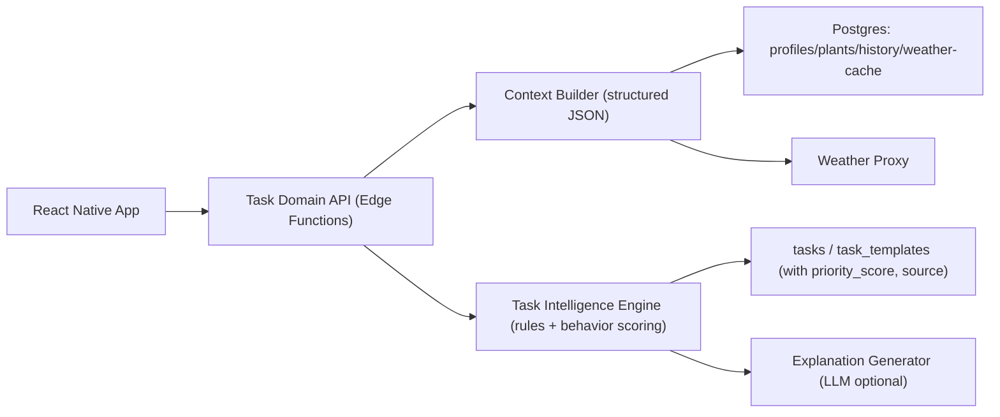

# Repository-Analyse: FloraScout

Datum: 8. März 2026
Analysiertes Repository: `Mein-Gaertner-App`

## Executive Summary

Das Repository ist funktional solide für ein MVP, aber die Task-Erstellung ist aktuell nur begrenzt "smart": hauptsächlich manuell plus einfache Wiederholungslogik, mit optionaler KI-Erstellung im Chat. Wetter-, Saison- und Verhaltensdaten werden nur teilweise erfasst und kaum in die eigentliche Aufgabenplanung eingespeist. Positiv sind robuste Retry-/Timeout-Mechanismen, Credit-/Rate-Limit-Handling und ein guter Start bei Event-Historie. Kritisch ist jedoch deutliche Schema-Drift zwischen App-Code und Migrationen, was Deployments und Weiterentwicklung riskant macht.

## Detailanalyse

### 1) Aufgaben-Erstellung (Task Generation)

- Wie werden Aufgaben erstellt?
  Primär manuell über Dialog plus `createTask`/`createRecurringTask` ([AddTaskDialog.js](/Users/tim.esanum/Documents/GitHub/Mein-Gaertner-App/components/AddTaskDialog.js:30), [TaskListScreen.js](/Users/tim.esanum/Documents/GitHub/Mein-Gaertner-App/screens/TaskListScreen.js:121), [taskService.js](/Users/tim.esanum/Documents/GitHub/Mein-Gaertner-App/services/taskService.js:124), [taskService.js](/Users/tim.esanum/Documents/GitHub/Mein-Gaertner-App/services/taskService.js:138)).
  Zusätzlich KI-gestützt via Function Calling im Chat (`create_task`, `create_recurring_task`) ([ai-chat/index.ts](/Users/tim.esanum/Documents/GitHub/Mein-Gaertner-App/supabase/functions/ai-chat/index.ts:155), [ai-chat/index.ts](/Users/tim.esanum/Documents/GitHub/Mein-Gaertner-App/supabase/functions/ai-chat/index.ts:262)).

- Regelbasiert vs KI vs statisch
  Wiederkehrung/Catch-up ist klar regelbasiert (Intervall plus Dedupe plus State) ([taskService.js](/Users/tim.esanum/Documents/GitHub/Mein-Gaertner-App/services/taskService.js:318), [taskService.js](/Users/tim.esanum/Documents/GitHub/Mein-Gaertner-App/services/taskService.js:364)).
  KI erstellt Tasks nur auf explizite User-Interaktion im Chat, nicht autonom.

- Saisonalität/Wetter/Klimazone
  Wetter ist vorhanden, aber nur als UI-Widget/Badges; keine direkte Task-Planungslogik ([weatherService.js](/Users/tim.esanum/Documents/GitHub/Mein-Gaertner-App/services/weatherService.js:298), [WeatherWidget.js](/Users/tim.esanum/Documents/GitHub/Mein-Gaertner-App/components/WeatherWidget.js:175)).
  Im Chat-Prompt wird "Season" erwähnt, aber ohne expliziten Wetter-/Datums-/Klimakontext ([ai-chat/index.ts](/Users/tim.esanum/Documents/GitHub/Mein-Gaertner-App/supabase/functions/ai-chat/index.ts:144)).

- Individueller Pflanzenzustand
  Teilweise: letzter Healthcheck und offene Tasks fließen in Chat-Kontext ein ([ai-chat/index.ts](/Users/tim.esanum/Documents/GitHub/Mein-Gaertner-App/supabase/functions/ai-chat/index.ts:40), [ai-chat/index.ts](/Users/tim.esanum/Documents/GitHub/Mein-Gaertner-App/supabase/functions/ai-chat/index.ts:55)).
  Kein strukturierter Einbezug von Alter, Topfgröße, Substrat, Lichtstunden etc. im Task-Algorithmus.

- Priorisierung/Dringlichkeit
  Keine explizite Prioritätsstufe im Datenmodell (`priority`, `urgency` fehlt). Priorität entsteht indirekt über `due_at`, Overdue-Status und UI-Farbe ([TaskListScreen.js](/Users/tim.esanum/Documents/GitHub/Mein-Gaertner-App/screens/TaskListScreen.js:31)).

- Mustererkennung ("vergisst Düngen") und adaptive Logik
  Nein. Es gibt Events/History (z. B. `gardening_events`, `task_run` Nutzung im Code), aber keine Lernlogik darüber ([taskService.js](/Users/tim.esanum/Documents/GitHub/Mein-Gaertner-App/services/taskService.js:198), [20260303_scores_and_leaderboard.sql](/Users/tim.esanum/Documents/GitHub/Mein-Gaertner-App/supabase/migrations/20260303_scores_and_leaderboard.sql:46)).

- Smartness-Score Task-Erstellung: 3/10
  Gute Basis (Recurring plus Idempotenz plus Catch-up), aber geringe Kontexttiefe, keine echte Prioritätsintelligenz, keine Verhaltensadaption.

### 2) Kontext-Qualität

- User-Kontext
  Erfasst: Profilbasis, Sprache, Land, Notifications, Privacy-Opt-ins ([ProfileCompleteScreen.js](/Users/tim.esanum/Documents/GitHub/Mein-Gaertner-App/screens/ProfileCompleteScreen.js:28), [SettingsScreen.js](/Users/tim.esanum/Documents/GitHub/Mein-Gaertner-App/screens/SettingsScreen.js:150)).
  Nicht erfasst: Erfahrungslevel, Zeitbudget, Pflegepräferenzen als strukturierte Felder.

- Pflanzen-Kontext
  Modell enthält `name`, `note`, `details`, `zone_id`, `species_id` ([20250101_baseline_schema.sql](/Users/tim.esanum/Documents/GitHub/Mein-Gaertner-App/supabase/migrations/20250101_baseline_schema.sql:70), [20260304_zones.sql](/Users/tim.esanum/Documents/GitHub/Mein-Gaertner-App/supabase/migrations/20260304_zones.sql:25), [20260322_species_details_cache.sql](/Users/tim.esanum/Documents/GitHub/Mein-Gaertner-App/supabase/migrations/20260322_species_details_cache.sql:55)).
  Fehlen als First-Class-Felder: Sorte, Topfgröße, Substrat, Bewässerungsart, Lichtprofil je Pflanze.

- Historie/Statistik
  Vorhanden: `plant_diary`, `plant_healthchecks`, `discovery_events`, `gardening_events` ([20260309_v2_features_diary_dex_weather.sql](/Users/tim.esanum/Documents/GitHub/Mein-Gaertner-App/supabase/migrations/20260309_v2_features_diary_dex_weather.sql:7), [20250101_baseline_schema.sql](/Users/tim.esanum/Documents/GitHub/Mein-Gaertner-App/supabase/migrations/20250101_baseline_schema.sql:146), [20260303_scores_and_leaderboard.sql](/Users/tim.esanum/Documents/GitHub/Mein-Gaertner-App/supabase/migrations/20260303_scores_and_leaderboard.sql:29), [20260303_scores_and_leaderboard.sql](/Users/tim.esanum/Documents/GitHub/Mein-Gaertner-App/supabase/migrations/20260303_scores_and_leaderboard.sql:46)).
  Aber kein dediziertes Modell für Wachstum/Ernte/Symptom-Timeline mit strukturierten Messwerten.

- Umwelt-Kontext
  Wetter-API inklusive Forecast vorhanden ([weather-proxy/index.ts](/Users/tim.esanum/Documents/GitHub/Mein-Gaertner-App/supabase/functions/weather-proxy/index.ts:143), [weatherService.js](/Users/tim.esanum/Documents/GitHub/Mein-Gaertner-App/services/weatherService.js:151)).
  Nutzung in Aufgabenlogik minimal, primär Anzeige.

- LLM-Prompt-Kontext
  Chat-Prompt ist grundsätzlich gut strukturiert (Role/Style/Behavior/Tools), aber Kontext ist komprimierter Freitext statt strukturiertes JSON; nur letzte Healthchecks plus maximal 20 Tasks ([ai-chat/index.ts](/Users/tim.esanum/Documents/GitHub/Mein-Gaertner-App/supabase/functions/ai-chat/index.ts:84), [ai-chat/index.ts](/Users/tim.esanum/Documents/GitHub/Mein-Gaertner-App/supabase/functions/ai-chat/index.ts:62)).
  Rolling Summary reduziert Kontextkosten, kann aber wichtige Details verlieren ([ai-chat/index.ts](/Users/tim.esanum/Documents/GitHub/Mein-Gaertner-App/supabase/functions/ai-chat/index.ts:468)).

### 3) Architektur und Code-Qualität

- Datenmodell
  Positiv: Event-Logs, RLS, Recurring-Templates, Species-Cache sind gute Bausteine ([20260226_task_engine_v2.sql](/Users/tim.esanum/Documents/GitHub/Mein-Gaertner-App/supabase/migrations/20260226_task_engine_v2.sql:16), [20260322_species_details_cache.sql](/Users/tim.esanum/Documents/GitHub/Mein-Gaertner-App/supabase/migrations/20260322_species_details_cache.sql:25)).
  Kritisch: deutliche Schema-Drift. Beispiel: `messages` in Baseline mit `role`, App-Code nutzt `sender` ([20250101_baseline_schema.sql](/Users/tim.esanum/Documents/GitHub/Mein-Gaertner-App/supabase/migrations/20250101_baseline_schema.sql:126), [chatService.js](/Users/tim.esanum/Documents/GitHub/Mein-Gaertner-App/services/chatService.js:5), [ai-chat/index.ts](/Users/tim.esanum/Documents/GitHub/Mein-Gaertner-App/supabase/functions/ai-chat/index.ts:417)).
  Zusätzlich nutzt Code `task_run`, aber in Migrationen fehlt `CREATE TABLE task_run` (Nutzung: [taskService.js](/Users/tim.esanum/Documents/GitHub/Mein-Gaertner-App/services/taskService.js:200)).
  Außerdem widersprüchliche Healthcheck-ID-Fixes (UUID vs BIGINT) deuten auf inkonsistente Umgebungen ([20250101_baseline_schema.sql](/Users/tim.esanum/Documents/GitHub/Mein-Gaertner-App/supabase/migrations/20250101_baseline_schema.sql:147), [20260307210000_fix_tasks_rls_insert_delete_and_healthchecks_seq.sql](/Users/tim.esanum/Documents/GitHub/Mein-Gaertner-App/supabase/migrations/20260307210000_fix_tasks_rls_insert_delete_and_healthchecks_seq.sql:17), [20260318_fix_healthcheck_id_default.sql](/Users/tim.esanum/Documents/GitHub/Mein-Gaertner-App/supabase/migrations/20260318_fix_healthcheck_id_default.sql:4)).

- API-Design
  Gemischt: direkte DB-Zugriffe aus Screens/Services plus Edge Functions. Das ist pragmatisch, aber koppelt UI stark an DB-Schema und erschwert Vertragsstabilität ([TaskListScreen.js](/Users/tim.esanum/Documents/GitHub/Mein-Gaertner-App/screens/TaskListScreen.js:74), [HomeManager.jsx](/Users/tim.esanum/Documents/GitHub/Mein-Gaertner-App/screens/HomeManager.jsx:53), [aiService.js](/Users/tim.esanum/Documents/GitHub/Mein-Gaertner-App/services/aiService.js:99)).

- Separation of Concerns
  Teilweise gut (Service-Layer, Shared Helpers), aber noch viele Direktzugriffe in UI.
  Zusätzlich inkonsistente Task-Typ-Standards zwischen Registry (neutral) und Chat-Tools (deutsche Legacy-Werte) ([taskTypes.js](/Users/tim.esanum/Documents/GitHub/Mein-Gaertner-App/constants/taskTypes.js:4), [ai-chat/index.ts](/Users/tim.esanum/Documents/GitHub/Mein-Gaertner-App/supabase/functions/ai-chat/index.ts:171)).

- Error Handling
  Stark im Netzwerk-/AI-Pfad (Timeout, Retry, Auth-Recovery, Credit-Refund) ([networkPolicy.js](/Users/tim.esanum/Documents/GitHub/Mein-Gaertner-App/services/networkPolicy.js:112), [aiService.js](/Users/tim.esanum/Documents/GitHub/Mein-Gaertner-App/services/aiService.js:99), [ai-healthcheck/index.ts](/Users/tim.esanum/Documents/GitHub/Mein-Gaertner-App/supabase/functions/ai-healthcheck/index.ts:227)).
  Schwächer bei stillen Fehlern/Workarounds (z. B. Schema-Cache-Fallbacks, non-blocking catches).

- Testing
  Positiv: 13 Suites und 139 Tests bestanden.
  Aktueller Lauf: Statements 53.67%, Branches 50.84%, Functions 52.98%, Lines 54.83%.
  Geringe Abdeckung in kritischen Services (u. a. Leaderboard, Purchase, Notifications).

## Scoring-Tabelle (1-10)

| Bereich                         | Score | Kurzbegründung                                                                                                                       |
| ------------------------------- | ----: | ------------------------------------------------------------------------------------------------------------------------------------ |
| Aufgaben-Erstellung (Smartness) |     3 | Solide Recurrence-Engine, aber kaum kontext- oder verhaltensadaptive Intelligenz.                                                    |
| Kontext-Qualität                |     5 | Gute Basisdaten plus Historie plus Wetter vorhanden, aber wenig strukturierte Personalisierungsdaten und geringe Nutzung in Planung. |
| Architektur und Code-Qualität   |     6 | Gute Resilience/Services, aber relevante Schema-Drift und inkonsistente Verantwortlichkeiten.                                        |
| Gesamt                          |   4.7 | Technisch tragfähiges MVP mit klaren Hebeln für "smarte" Next-Gen-Planung.                                                           |

## Priorisierte Verbesserungsliste

### Quick Wins (wenig Aufwand, hoher Impact)

1. Task-Typen vereinheitlichen  
   WAS: Chat-Tooling von Legacy-Enums auf neutrale Codes umstellen.  
   WARUM: Aktuell inkonsistent zwischen Registry und AI-Tooling.  
   WIE: `ai-chat`-Enums auf `watering/fertilizing/...` ändern und Legacy-Mapping nur als Fallback behalten ([ai-chat/index.ts](/Users/tim.esanum/Documents/GitHub/Mein-Gaertner-App/supabase/functions/ai-chat/index.ts:171), [taskTypes.js](/Users/tim.esanum/Documents/GitHub/Mein-Gaertner-App/constants/taskTypes.js:14)).

2. Explizite Priorisierung einführen  
   WAS: `tasks.priority_score` und `tasks.urgency`.  
   WARUM: Aktuell nur implizit via `due_at`/Overdue.  
   WIE: DB-Spalten plus einfache Formel (`overdue_days`, `task_weight`, `health_delta`) und Sortierung danach.

3. Wetter/Saison in Task-Erstellung einspeisen  
   WAS: Wetterkontext in Chat-Task-Prompt und Regelengine integrieren.  
   WARUM: Wetterdaten sind da, aber ungenutzt für Entscheidung.  
   WIE: `loadGardenContext` um Wetterflags ergänzen; bei `create_task` Terminlogik anpassen ([weatherService.js](/Users/tim.esanum/Documents/GitHub/Mein-Gaertner-App/services/weatherService.js:298), [ai-chat/index.ts](/Users/tim.esanum/Documents/GitHub/Mein-Gaertner-App/supabase/functions/ai-chat/index.ts:28)).

4. Schema-Contract-Checks in CI  
   WAS: Automatischer Check auf Pflichttabellen/-spalten (`messages.sender|role`, `task_run`, FK/Constraints).  
   WARUM: Aktuelle Drift ist der größte Stabilitätsrisiko-Treiber.  
   WIE: SQL-Assertions plus `supabase db reset` Smoke-Test plus fail-fast.

### Medium-Term (mittlerer Aufwand, deutliche Verbesserung)

1. Strukturierter Context Builder (statt Freitext)  
   WAS: Kontext als JSON-Schema (`user`, `plants`, `history`, `environment`, `preferences`) an LLM geben.  
   WARUM: Weniger Informationsverlust, besser testbar.  
   WIE: eigene Edge-Funktion `build_task_context`, dann Prompt nur noch "Interpret this JSON".

2. Daily Recommendation Job  
   WAS: Täglicher Job, der pro Pflanze Aufgabenvorschläge erzeugt (nicht nur bei Chat-Anfrage).  
   WARUM: Echte Assistenz statt reaktiver Bedienung.  
   WIE: Scheduler plus idempotentes Upsert über `dedupe_key` und `source='engine'`.

3. Pflanzenmodell normalisieren  
   WAS: Wichtige Pflegeattribute als Spalten/Tabelle (`pot_size`, `substrate`, `light_exposure`, `watering_method`, `last_watered_at`, `last_fertilized_at`).  
   WARUM: Derzeit sind diese Infos nicht maschinenlesbar für die Engine.  
   WIE: neue `plant_care_profile`-Tabelle, schrittweise Backfill aus `details`/UI.

### Long-Term Vision (größerer Umbau)

1. Adaptive Task Intelligence Engine  
   WAS: Verhaltensbasiertes Modell (z. B. "skipped fertilizing 3x" => Reminder-Strategie ändern).  
   WARUM: Das hebt Smartness von regelbasiert auf personalisiert.  
   WIE: Features aus `gardening_events` plus `task_run` plus Weather plus Plant State, Scoring-Modell mit erklärbaren Gründen.

2. Domain-API statt Direkt-Supabase aus UI  
   WAS: klare Boundary: App ruft nur Domain-Endpoints auf (`/tasks/recommend`, `/tasks/complete`, `/context`).  
   WARUM: Entkoppelt UI von Schema, stabilere Releases, bessere Versionierung.  
   WIE: schrittweiser Strangler-Ansatz; bestehende Services als Adapter.

## Architektur-Vorschlag für die wichtigsten Änderungen

Kernprinzip: Kontext strukturieren, Entscheidung entkoppeln, Priorisierung explizit machen. Dadurch steigen Smartness, Nachvollziehbarkeit und Betriebssicherheit gleichzeitig.
